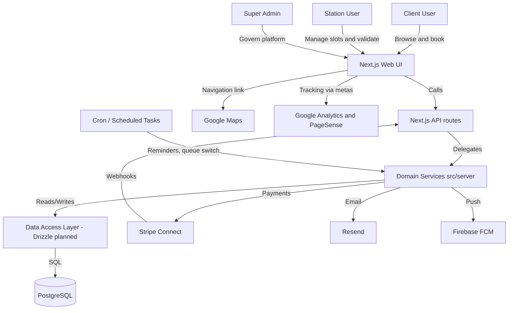

# LAVO Architecture

## Project Tree Structure

```
lavo/
├── docs/                    # Project documentation
│   ├── ARCHITECTURE.md
│   ├── CHARTS_PROVIDER.md
│   ├── DATABASE.md
│   ├── DEPLOYMENT.md
│   ├── FEATURES.md
│   ├── INSTALLATION.md
│   ├── PAGE_LISTING.md
│   ├── PROJECT_SUMMARY.md
│   └── TESTING_STRATEGY.md
├── messages/                # next-intl locale files
│   ├── en.json
│   └── fr.json
├── public/                  # Static assets
├── src/
│   ├── app/
│   │   ├── api/v1/          # REST API route handlers
│   │   │   ├── admin/dashboard/
│   │   │   ├── auth/register/
│   │   │   ├── health/
│   │   │   ├── history/
│   │   │   │   ├── client/
│   │   │   │   └── station/
│   │   │   ├── ratings/
│   │   │   ├── reservations/
│   │   │   ├── station/config/
│   │   │   ├── stations/
│   │   │   ├── support/
│   │   │   └── webhooks/stripe/
│   │   ├── [locale]/        # Locale-prefixed UI routes
│   │   │   ├── (admin)/admin/      # Super Admin pages
│   │   │   ├── (client)/client/   # Client dashboard pages
│   │   │   ├── (public)/          # Public pages (home, login, register, stations)
│   │   │   ├── (station)/station/  # Station dashboard pages
│   │   │   └── layout.tsx
│   │   ├── globals.css
│   │   └── layout.tsx
│   ├── components/
│   │   ├── admin/           # Admin-specific components
│   │   ├── auth/            # LoginForm, RegisterForm
│   │   ├── history/         # ClientHistoryTable
│   │   ├── layout/          # MainLayout, ClientLayout, StationLayout, AdminLayout, etc.
│   │   ├── ratings/         # StarRating, RatingForm
│   │   ├── reservations/   # ReservationCard, SlotPicker
│   │   ├── stations/        # StationCard, StationDetail, SearchBar
│   │   └── ui/              # Button, Input, Card, Modal, Badge, Spinner, etc.
│   ├── context/            # Auth, Theme, Toast providers
│   ├── helpers/             # constants, validators, string-helper, date-helper
│   ├── i18n/                # routing, request, navigation (next-intl)
│   ├── lib/                 # errors, responses; db/ (Drizzle placeholder)
│   ├── server/              # Domain services (auth, stations, reservations, payments, admin, etc.)
│   ├── services/            # axios, local-storage, cookie, memory-cache
│   ├── types/               # Shared TypeScript types (placeholder)
│   └── middleware.ts        # next-intl locale middleware
├── tests/
│   ├── unit/
│   ├── integration/
│   └── e2e/
├── .env.example
├── jest.config.ts
├── jest.setup.ts
├── next.config.ts
├── package.json
├── postcss.config.mjs
├── tsconfig.json
└── README.md
```

Route groups `(public)`, `(client)`, `(station)`, `(admin)` do not appear in URLs; only `[locale]` and the page path do (e.g. `/fr/login`, `/en/client/dashboard`).

## System Overview

LAVO is a full-stack Next.js application that combines a web UI (clients, stations, and Super Admin) with REST API endpoints under `/api/v1`. The codebase is structured by business domains and follows a layered approach to keep pages/routes thin and concentrate business rules inside server-side services.

## Architecture Diagram



## Component Breakdown

### Web UI (App Router)

The UI is implemented as locale-prefixed routes (`/fr`, `/en`) using `next-intl`. Route groups separate concerns for public, client, station, and admin areas while keeping URLs clean. Pages should focus on rendering, orchestration, and calling API endpoints or server actions. Cross-cutting UI concerns (theme, auth state, toast notifications) are managed with React context providers.

### API Routes (`/api/v1`)

API endpoints are implemented using Next.js App Router route handlers. Routes are grouped by domain (auth, stations, reservations, payments/webhooks, ratings, history, admin, support). Input validation is planned to be enforced at every boundary using Zod. Response and error handling are standardized via shared helpers to keep contract consistency.

**Admin role naming:** The database and JWT store the platform operator role as the string `'admin'`. The UI may show “Super Admin” or `SUPER_ADMIN` as a label only — API and authorization checks must use `'admin'`, not a separate `super_admin` enum value unless the schema is explicitly migrated.

### Domain Services (`src/server/*`)

Domain services are the canonical place for business rules such as slot capacity handling, queue switching, commission calculations, and notification triggers. This layer is designed to be framework-light and callable from both API routes and future background jobs. Services orchestrate external providers (Stripe, Resend, FCM) behind a stable internal interface. This keeps the application testable and prevents provider-specific logic from spreading into the UI and route handlers.

### Data Access Layer (Drizzle planned)

Persistence will be implemented using Drizzle ORM with PostgreSQL. The data model is defined by the technical specification and Trello (notably a dedicated no-show fee table and QR booking commission rules). Migrations and indexing strategy are considered part of the “foundation” work to ensure consistency across environments. Development will use Neon; production will use Railway PostgreSQL.

### External Integrations

Stripe Connect handles payment capture and split payouts (including optional tips). Resend handles transactional email flows such as verification, booking confirmations, and admin summaries. Firebase FCM handles push notifications for reminders, status changes, and operational events. Google Maps is used via a simple outgoing link to avoid embedded map complexity. Analytics scripts are planned to be injected only via application metas, keeping tracking isolated from business logic.

## Technology Decisions

| Decision | Choice | Why | Alternatives considered |
|---|---|---|---|
| Web framework | Next.js (App Router) | One codebase for UI + API; strong routing and SSR/SEO | Express + separate SPA |
| Localization | next-intl | Locale routing, message loading, ergonomic APIs | next-i18next |
| ORM | Drizzle ORM | Type-safe schema-first approach, SQL-friendly | Prisma (originally referenced in spec) |
| Validation | Zod | Runtime validation with TypeScript inference | Yup, Joi |
| Payments | Stripe Connect | Platform commission model and payouts to stations | PayPal, Adyen |
| Email | Resend | Simple transactional email API | SendGrid, Mailgun |
| Push notifications | Firebase FCM | Standard push delivery for mobile/web | OneSignal |
| Database hosting | Neon (dev), Railway (prod) | Simple dev provisioning; production infra on Railway | Supabase, RDS |

## Design Patterns

- **Layered architecture**: UI/API routes delegate to domain services; data access is isolated.
- **Domain-first structure**: folders reflect business modules (auth, stations, reservations, payments, admin, notifications).
- **Boundary validation**: Zod schemas at API boundaries (planned) to protect business logic.
- **Standardized responses and errors**: shared helpers to keep API contracts consistent.
- **Cross-cutting concerns via providers**: theme/auth/toast contexts avoid prop drilling and centralize global behavior.

