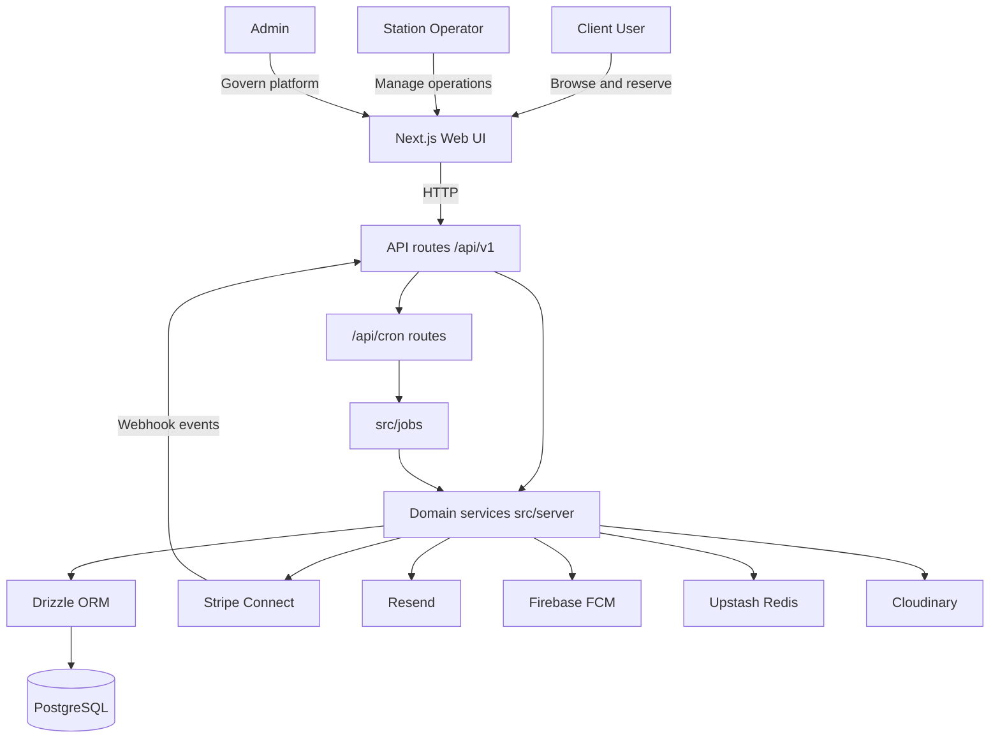
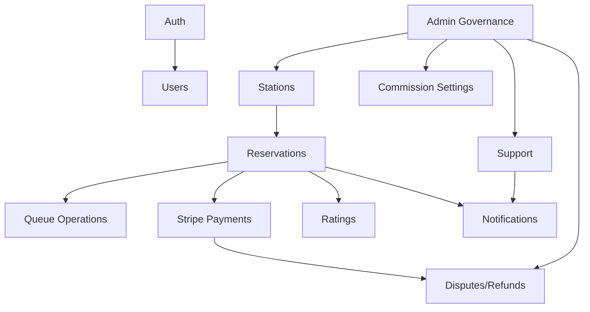
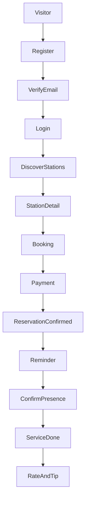
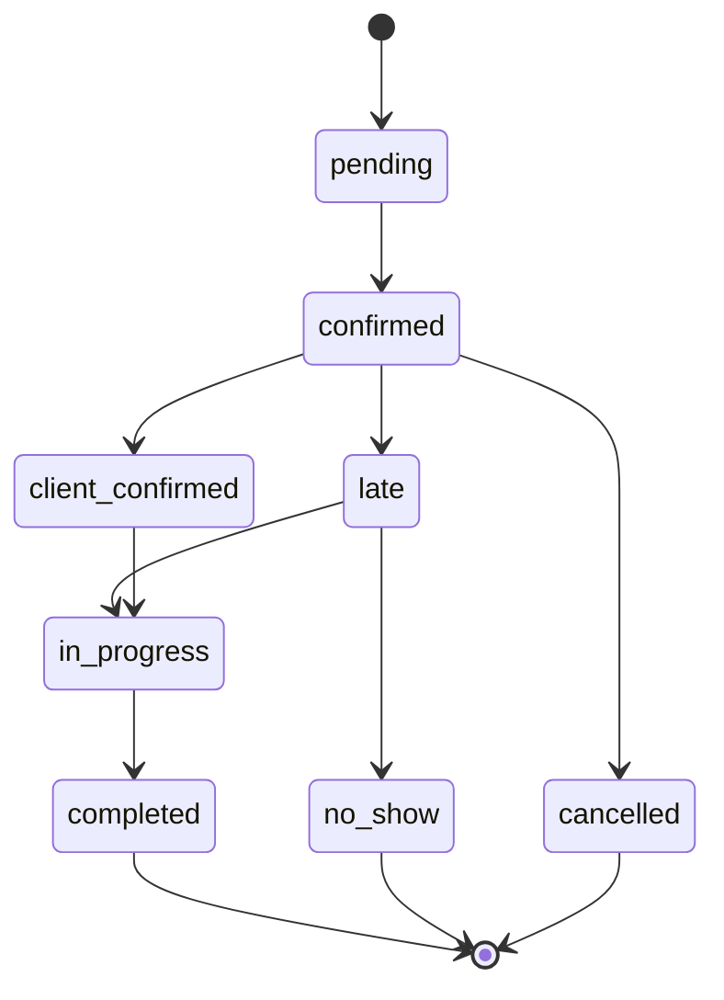
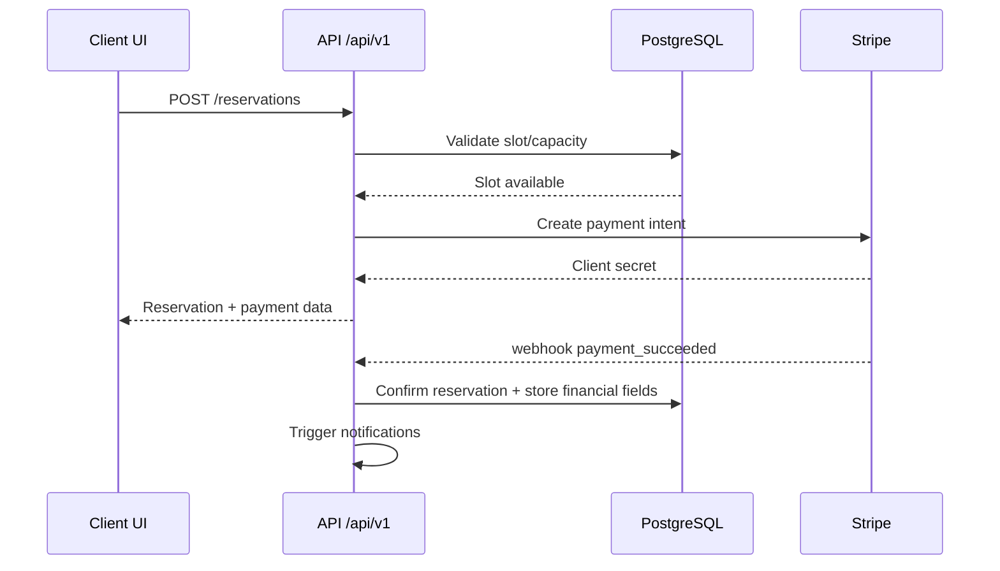
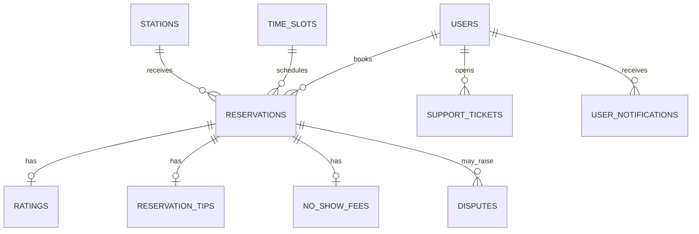
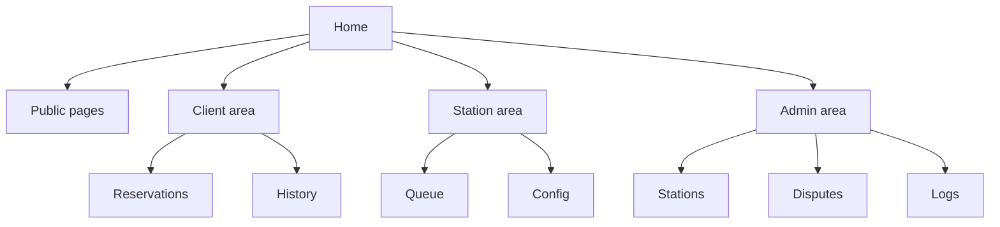

# Hurryline Charts Provider

## System Architecture
**Purpose**: High-level component structure and provider integrations

**Usage**: Reference in `docs/ARCHITECTURE.md`

## Domain Interaction Map
**Purpose**: Major domain dependencies

**Usage**: Reference in `docs/ARCHITECTURE.md` and `docs/FEATURES.md`

## Main User Journey
**Purpose**: End-to-end client path

**Usage**: Reference in `docs/FEATURES.md`

## Reservation State Model
**Purpose**: Reservation lifecycle

**Usage**: Reference in `docs/FEATURES.md`

## Booking Sequence
**Purpose**: Typical API sequence for reservation creation

**Usage**: Reference in `docs/FEATURES.md`

## Core ER Diagram
**Purpose**: Data relationships at a glance

**Usage**: Reference in `docs/DATABASE.md`

## Navigation Map
**Purpose**: Frontend route hierarchy by role

**Usage**: Reference in `docs/PAGE_LISTING.md`
