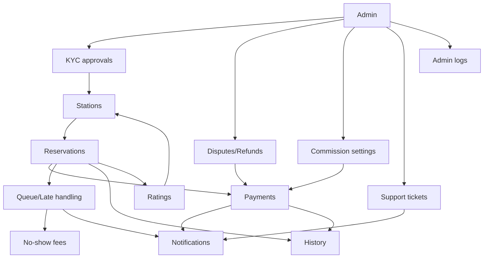
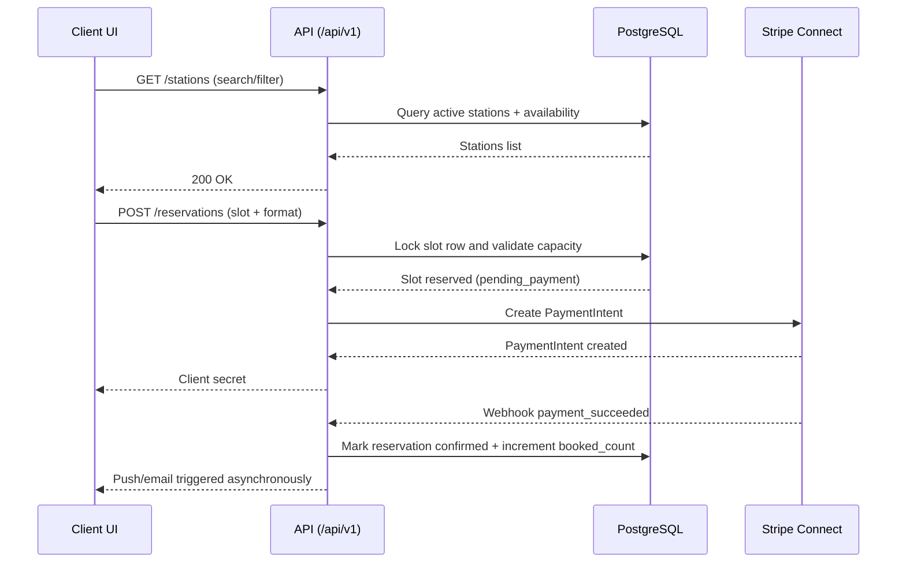
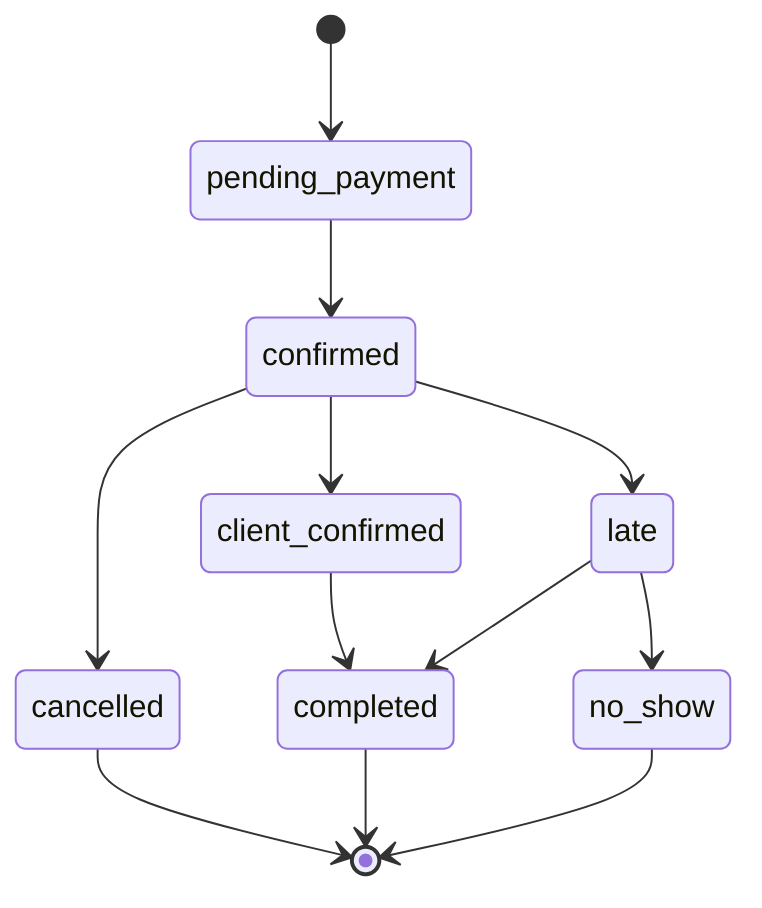
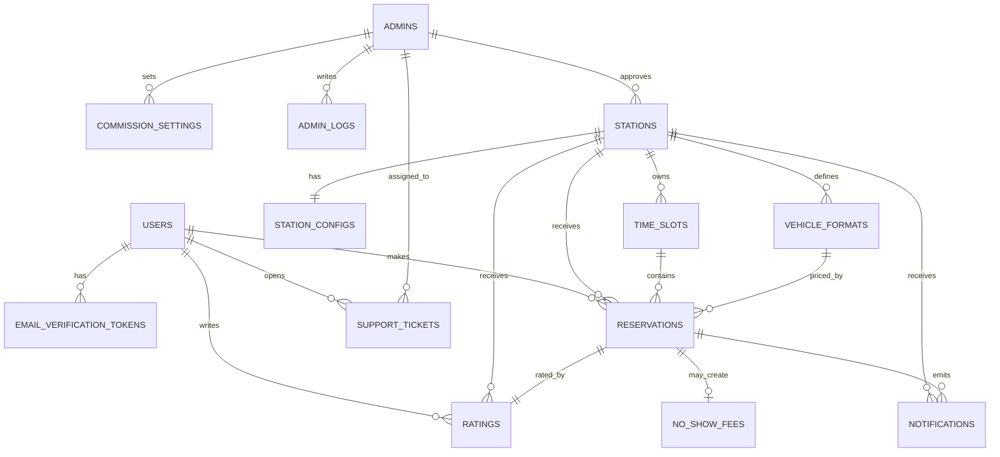
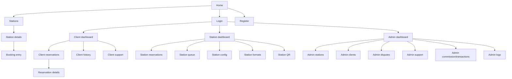

# LAVO Charts Provider

## System Architecture
**Purpose**: High-level components and external integrations

```mermaid
flowchart TD
    ClientUser[Client User] -->|Browse and book| WebUI[Next.js Web UI]
    StationUser[Station User] -->|Manage slots and validate| WebUI
    AdminUser[Super Admin] -->|Govern platform| WebUI

    WebUI -->|Calls| ApiRoutes[Next.js API Routes /api/v1]
    ApiRoutes -->|Delegates| DomainServices[Domain Services src/server]
    DomainServices -->|Reads/Writes| DataLayer[Data Access Layer (Drizzle planned)]
    DataLayer -->|SQL| Postgres[(PostgreSQL)]

    DomainServices -->|Payments| Stripe[Stripe Connect]
    DomainServices -->|Email| Resend[Resend]
    DomainServices -->|Push| Fcm[Firebase FCM]
    WebUI -->|Navigation link| Maps[Google Maps]
    WebUI -->|Tracking via metas| Analytics[Google Analytics / PageSense]

    CronJobs[Cron / Scheduled Tasks] -->|Reminders, queue switch| DomainServices
    Stripe -->|Webhooks| ApiRoutes
```

**Usage**: Reference in `docs/ARCHITECTURE.md`

## Domain Interaction Map
**Purpose**: How business domains coordinate



**Usage**: Reference in `docs/ARCHITECTURE.md` and `docs/FEATURES.md`

## Main User Journey
**Purpose**: Client booking flow end-to-end

```mermaid
flowchart TD
    Visitor[Visitor] --> AuthRegister[Create account]
    AuthRegister --> AuthVerify[Email verification]
    AuthVerify --> AuthLogin[Session established]

    AuthLogin --> StationList[Stations listing]
    StationList --> StationDetail[Station details]
    StationDetail --> VehicleFormat[Vehicle format]
    VehicleFormat --> SlotSelect[Time slot selection]
    SlotSelect --> StripeCheckout[Stripe payment]
    StripeCheckout --> BookingConfirmed[Reservation confirmed]

    BookingConfirmed --> Reminder5h[Push reminder (5h)]
    BookingConfirmed --> Reminder30m[Push reminder (30m)]
    Reminder30m --> Presence[Presence confirmation]
    Reminder30m --> LateFlow[Late tolerance]
    LateFlow --> Queue[Queue switch]

    Presence --> Completed[Service completed]
    Completed --> Rating[Rating]
    Completed --> Tip[Tip (optional)]
    Completed --> History[History and receipts]
```

**Usage**: Reference in `docs/FEATURES.md`

## Booking Sequence (API interactions)
**Purpose**: Typical request/response interactions during booking



**Usage**: Reference in `docs/FEATURES.md`

## Reservation State Model
**Purpose**: Reservation lifecycle states described in the technical spec



**Usage**: Reference in `docs/FEATURES.md`

## ER Diagram
**Purpose**: Core entities and relationships



**Usage**: Reference in `docs/DATABASE.md`

## Site Navigation Map
**Purpose**: Page hierarchy and protected areas



**Usage**: Reference in `docs/PAGE_LISTING.md`

