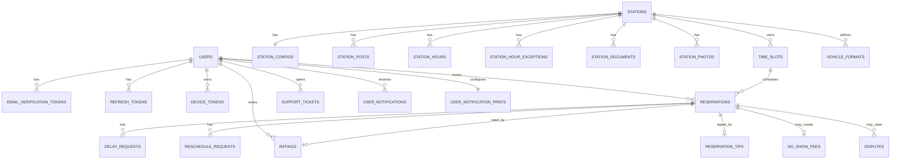

# Hurryline Database

## Database Type

**SQL (PostgreSQL)** with **Drizzle ORM** schemas and repository-driven access. Development is typically configured with Neon-compatible URLs; production target is Railway PostgreSQL.

## Entity Relationship Diagram

## Table Schemas (implemented modules)

Conventions used across modules:

- `snake_case` column naming
- UUID-oriented identifiers
- created/updated timestamps on mutable entities
- foreign keys + relations declared in Drizzle schema index

### Identity and access

- `users`: accounts, roles, status, profile fields
- `email_verification_tokens`: verification/reset token lifecycle
- `refresh_tokens`: session continuation and rotation
- `auth_rate_limits`: anti-abuse state

### Station domain

- `stations`, `station_configs`
- `station_documents`, `pending_uploads`, `station_photos`
- `station_posts`, `station_hours`, `station_hour_exceptions`
- `vehicle_formats`, `wash_types`, `station_wash_types`

### Reservation and operation domain

- `time_slots`
- `reservations`
- `delay_requests`, `reschedule_requests`
- `no_show_fees`

### Commercial catalog domain

- `station_services`, `service_vehicle_entries`
- `station_extras`, `extra_vehicle_entries`
- `service_extra_compatibility`

### Engagement and communication

- `ratings`, `favorites`
- `notifications`, `user_notifications`, `user_notification_prefs`
- `device_tokens`

### Governance and support

- `disputes`
- `commission_settings`
- `support_tickets`, `support_messages`, `support_settings`
- `admin_logs`
- `platform_settings`, legal/settings-related tables

## Indexes and constraints

- Unique and lookup constraints for identity/token correctness.
- Reservation and slot indexing optimized through migration set for date/station/status filtering.
- Relation integrity defined both in SQL migrations and Drizzle relation declarations.
- Financial columns (commission/tip/payout/reconciliation markers) persisted for traceability.

## Migration status

- SQL migrations in repository: **53**
- Migration path maintained under `src/lib/db/migrations`

