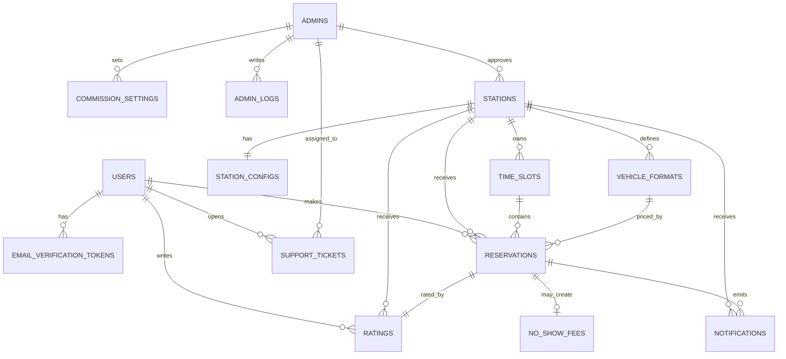

# LAVO Database

## Database Type

**SQL (PostgreSQL)**. Development uses Neon; production uses Railway PostgreSQL. The persistence layer will be implemented with **Drizzle ORM** (schema and migrations are planned but not yet present in the repository).

## Entity Relationship Diagram

## Table Schemas (planned)

Conventions from the technical specification:

- **Naming**: `snake_case` for tables and columns
- **IDs**: UUID v4 primary keys
- **Timestamps**: `created_at` and `updated_at` on all mutable tables

### `users`

- **Purpose**: client accounts and identity
- **Key fields**: `email (unique)`, `password_hash`, `status (pending_verification|active|suspended)`, `stripe_customer_id`

### `email_verification_tokens`

- **Purpose**: email verification and password reset tokens
- **Key fields**: `user_id`, `token`, `type (email_verification|password_reset)`, `expires_at`, `used_at`

### `stations`

- **Purpose**: station identity + approval lifecycle
- **Key fields**: `status (pending|active|suspended|rejected)`, `is_open` (reserved internal/future), `stripe_account_id`, `approved_by`, `average_score`, `total_ratings`

### `station_configs`

- **Purpose**: operational configuration per station (1:1)
- **Key fields**: `opening_time`, `closing_time`, `wash_duration_minutes`, `wash_post_count`, `late_tolerance_minutes`

### `vehicle_formats`

- **Purpose**: per-station pricing by vehicle size/format
- **Key fields**: `station_id`, `label`, `price`, `is_active`

### `time_slots`

- **Purpose**: manually created bookable slots with multi-capacity
- **Key fields**: `station_id`, `start_time`, `end_time`, `capacity`, `booked_count`, `status (available|full|blocked)`

### `reservations`

- **Purpose**: booking lifecycle, queueing, and financial snapshot
- **Key fields**: `user_id`, `station_id`, `time_slot_id`, `vehicle_format_id`, `status`, `queue_position`, `amount_paid`, `commission_rate`, `commission_amount`, `station_payout`, `tip_amount`, Stripe references

### `ratings`

- **Purpose**: post-service rating and comment (1 rating per completed reservation)
- **Key fields**: `reservation_id (unique)`, `score (1..5)`, `comment`, `is_visible`

### `notifications`

- **Purpose**: audit of push/email notifications sent by event
- **Key fields**: `type (push|email)`, `event`, `status (sent|failed|pending)`, optional `user_id`, `station_id`, `reservation_id`

### `commission_settings`

- **Purpose**: effective commission rate history set by admins
- **Key fields**: `rate`, `set_by`, `effective_at`

### `admins` and `admin_logs`

- **Purpose**: Super Admin accounts and audit trail
- **Key fields**: `admin_logs.action`, `target_type`, `target_id`, `details (jsonb)`

### `support_tickets`

- **Purpose**: support intake and admin handling
- **Key fields**: `created_by`, `assigned_to`, `subject`, `message`, `status`, `resolved_at`

### `no_show_fees` (Trello decision)

- **Purpose**: dedicated record for **no-show fees after queue switch**
- **Key fields (planned)**: `reservation_id`, `user_id`, `station_id`, `amount`, `reason`, `status (pending|paid|waived)`, Stripe references, `created_at`

## Indexes & Constraints (planned)

- **Uniqueness**: `users.email`, `ratings.reservation_id`, token uniqueness as needed
- **Operational queries**: `stations (status, city)`, `time_slots (station_id, start_time, status)`, `reservations (user_id, station_id, status, created_at DESC)`
- **Capacity safety**: update `time_slots.booked_count` using a row lock (`SELECT ... FOR UPDATE`) to prevent overbooking
