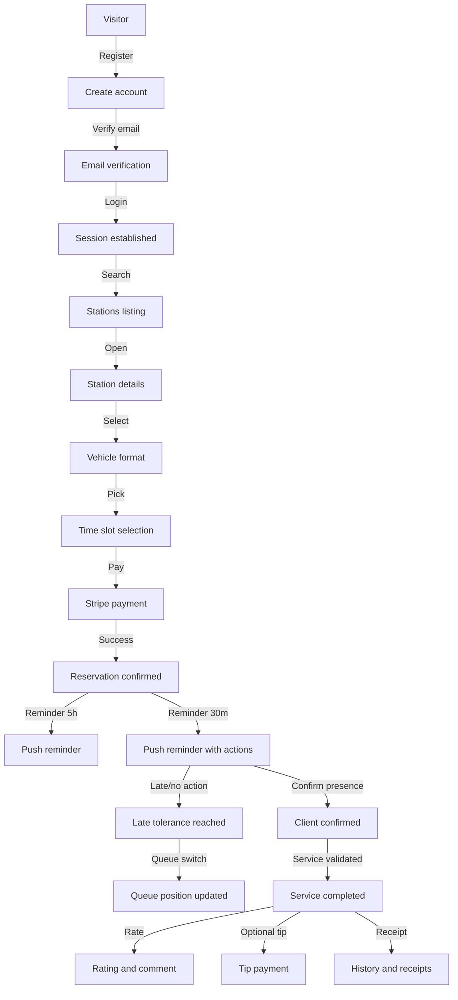
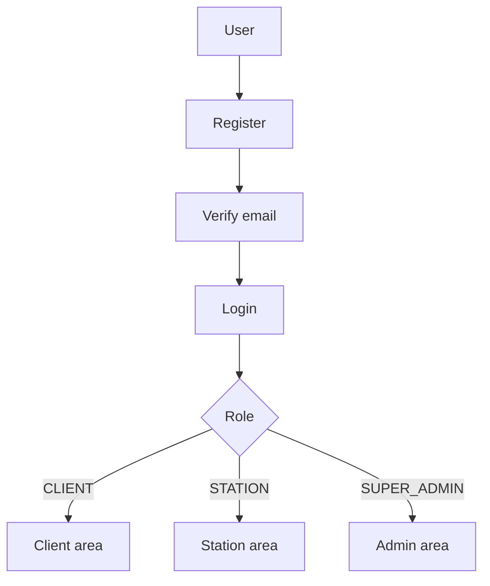
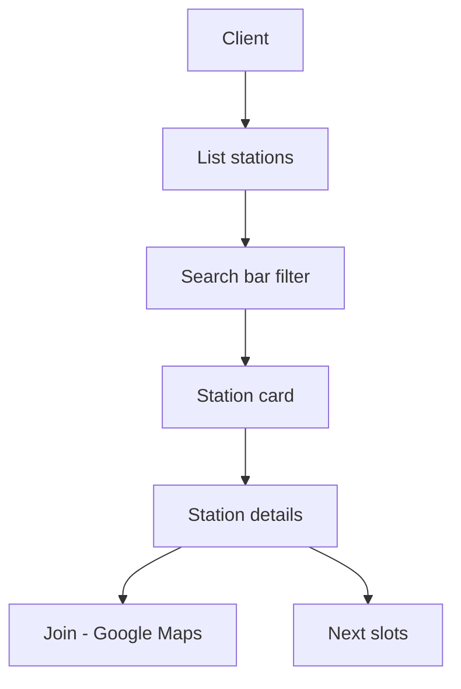
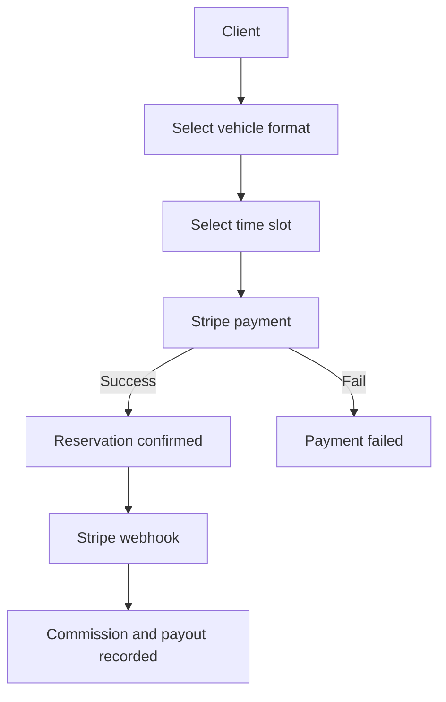
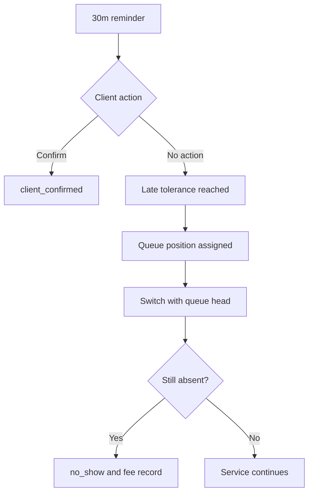
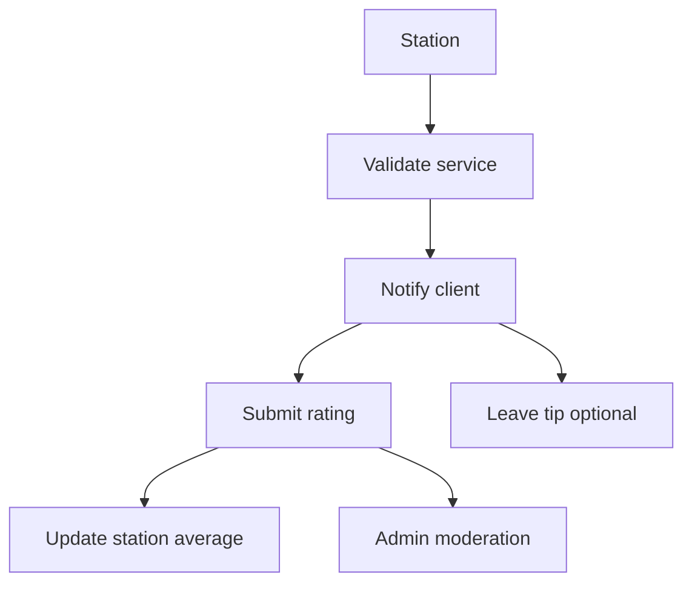
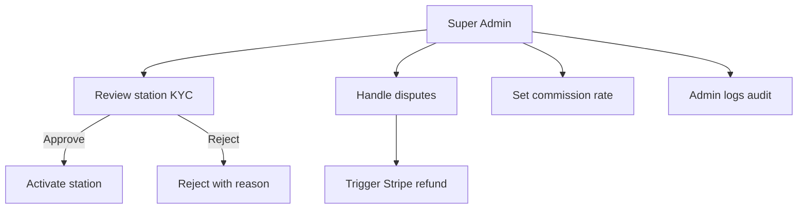

# Hurryline Features

## Feature Overview

Most business features are **planned** (the repository currently contains route and service scaffolding). This document reflects the validated technical specification and Trello backlog.

| Category | Feature | Description | Status |
|---|---|---|---|
| Auth | Account lifecycle | Register, verify email, login, password reset, session handling | [Planned] |
| Stations | Discovery | List/search stations and view station details | [Planned] |
| Reservations | Booking | Choose vehicle format, pick an available slot, confirm booking | [Planned] |
| Payments | Stripe Connect | Pay online, commission capture, station payout, refunds, tips | [Planned] |
| Operations | Late & queue | Reminders, client confirmation, late → queue switch, no-show fees | [Planned] |
| Ratings | Post-service rating | Rate station after completed service; moderation controls | [Planned] |
| Station space | Slot & pricing management | Configure posts, create slots manually, manage formats/prices | [Planned] |
| Admin | Governance | KPIs, KYC approvals, disputes/refunds, commission settings, logs | [Planned] |
| Support | Tickets | Client/station ticket creation and admin triage | [Planned] |
| Analytics | Tracking | Google Analytics / PageSense via application meta integration | [Planned] |
| Growth | Station QR | QR links to station details; QR bookings with special commission rule | [Planned] |

## Main User Journeys

## Feature Details

### Authentication and roles

Clients, stations, and Super Admins authenticate to different areas of the same web app. Accounts are activated through email verification, and protected endpoints require a valid session token. Authorization is role-based (CLIENT, STATION, SUPER_ADMIN) and applied consistently across UI routes and API endpoints. **Status**: [Planned]

### Station discovery

Clients can browse stations, search by text, and open a station detail page. Availability is presented via the station’s configured slots; “Join” redirects to Google Maps using GPS coordinates. Station closure is represented operationally by the absence of available slots (with `is_open` reserved for internal/future use). **Status**: [Planned]

### Reservations and payments

Booking requires choosing a vehicle format (pricing depends on it), selecting an available slot, and completing payment. A reservation is confirmed only after Stripe confirms payment; slot capacity is updated atomically to avoid overbooking. Commission is captured at payment time and applied at payout time, with a separate “QR booking” rule allowing 0% commission for eligible reservations. **Status**: [Planned]

### Late handling, queue switch, and no-show fees

Two reminders are sent before the slot, including an action to confirm presence. If a client does not confirm within the station-defined tolerance window, the reservation moves to a queue position and may be switched with the head of the queue. If the client remains absent after the switched client’s service, the reservation is marked as no-show and a dedicated no-show fee record is created. **Status**: [Planned]

### Post-service rating and tip

After a station validates a completed service, the client is invited to rate the station (1–5 stars with an optional comment). Clients may optionally leave a tip paid via Stripe and transferred fully to the station (no platform commission). Rating visibility can be moderated by the admin. **Status**: [Planned]

### Admin governance (KYC, disputes, commissions)

The Super Admin dashboard prioritizes KPIs and anomalies such as pending KYC and open disputes. Admins can approve or reject station applications (KYC), manage disputes and trigger refunds, update commission settings for future transactions, and audit actions via admin logs. This is the operational backbone of the platform and drives trust and compliance. **Status**: [Planned]

