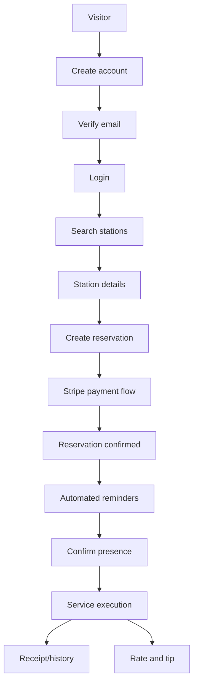

# Hurryline Features

## Feature Overview

| Category | Feature | Description | Status |
|---|---|---|---|
| Auth | Account lifecycle | Register, verify email, login/logout, refresh, reset/change password, role checks | [Implemented] |
| Stations | Discovery | List/search stations, station details, ratings, favorites, join/navigation links | [Implemented] |
| Stations | Onboarding & KYC | Submit station application, upload docs, validation steps, admin review flow | [Implemented] |
| Reservations | Booking | Vehicle format selection, slot booking, reservation lifecycle actions | [Implemented] |
| Queue & delays | Live operations | Delay signal/accept/refuse, queue join/pick/priority/start, no-show handling | [Implemented] |
| Payments | Stripe Connect | Webhook integration, tips, disputes/refund paths, reconciliation endpoints/jobs | [Implemented] |
| Notifications | Multi-channel | Email, push, user notifications feed, unread counters, preferences | [Implemented] |
| Station space | Configuration | Services/extras/formats, availability, hours, capacity, station profile/config | [Implemented] |
| Admin | Governance | Dashboard, legal content, disputes, logs, ratings moderation, platform settings | [Implemented] |
| Support | Tickets and messages | Support ticket creation, ticket thread messaging, admin assignment/settings | [Implemented] |
| Analytics | Tracking and KPI routes | Client/station/admin analytics routes and UI components | [Implemented] |
| Background jobs | Scheduled tasks | Reminders, stalled payment recovery, reconciliation, cleanup, KYC reminders | [Implemented] |

## Main User Journey

## Feature Details

### Authentication and role-based access

Authentication supports full credential lifecycle and refresh token rotation, with separate protected spaces for client, station, and admin roles. Verification and reset flows are implemented through dedicated endpoints and mail flows. Access rules are enforced in APIs and route-level guards.

**Status**: [Implemented]

### Station discovery and onboarding

Public users can browse stations, open detailed pages, and save favorites. Station onboarding includes multi-step validation and document upload endpoints; admins can then approve/reject submissions with governance traces.

**Status**: [Implemented]

### Reservations, delays, and queue orchestration

Reservation APIs cover creation and lifecycle operations (confirm presence, cancel, reschedule, signal delay). Queue APIs add station-side live controls such as picking queue entries, prioritization, and service start. No-show and late-handling logic is supported through dedicated services/jobs.

**Status**: [Implemented]

### Payments, disputes, and finance flows

Stripe webhooks and payment-oriented services support booking payments, tip flows, and dispute/refund operations. Commission and transaction endpoints plus reconciliation jobs provide finance-level visibility and operational safety.

**Status**: [Implemented]

### Notifications and support workflows

The platform includes device token registration, notification feed endpoints, unread counters, and preference updates. Support includes ticket creation, ticket message threads, admin assignment actions, and support settings management.

**Status**: [Implemented]

### Admin governance

Admin pages and APIs provide KPI dashboards, station/client/user management, disputes, legal content editing, ratings moderation, platform settings, and audit logs.

**Status**: [Implemented]

