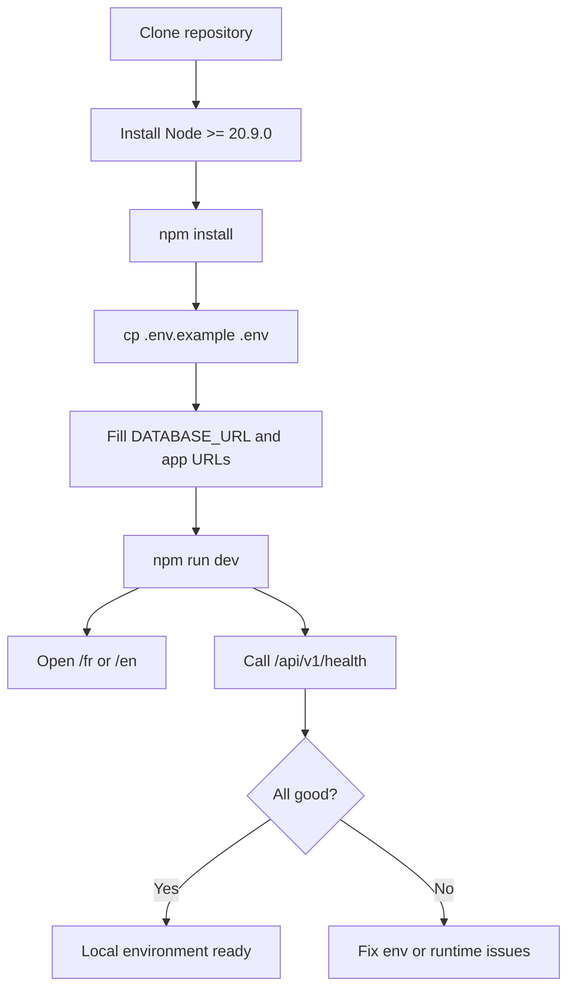

# Installation (Local Development)

## Prerequisites

- Node.js **>= 20.9.0**
- npm (or a compatible package manager)
- PostgreSQL connection string (Neon recommended for development)

## Installation Steps

1. Install dependencies.
2. Create your environment file from the template.
3. Start the development server.
4. Verify the app and API health endpoint.

```bash
npm install
cp .env.example .env
npm run dev
```

Verification:

- Open `http://localhost:3000/fr` (or `/en`)
- Call `http://localhost:3000/api/v1/health`

## Environment Setup

Set at minimum:

- `DATABASE_URL` (Neon in dev; Railway PostgreSQL in production)
- `NEXT_PUBLIC_APP_URL`
- `JWT_SECRET` (required once auth is implemented)

## Troubleshooting

- **Node version errors**: upgrade to Node >= 20.9.0 (Next.js 16 requirement).
- **Database connection errors**: ensure `DATABASE_URL` includes `sslmode=require` when using Neon.

## Installation Flow



