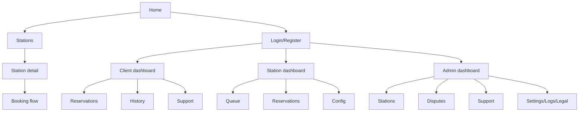

# Hurryline Page Listing

This project has a frontend web UI. All routes are locale-prefixed using `next-intl`:

- `/fr/...` (default)
- `/en/...`

Below, routes are shown as `/[locale]/...`.

## Route Structure Overview

```mermaid
flowchart TD
    Root[Locale root] --> Public[Public]
    Root --> Client[Client area]
    Root --> Station[Station area]
    Root --> Admin[Admin area]

    Public --> PubAuth[Auth pages]
    Public --> PubStations[Stations discovery]
    Public --> PubLegal[Legal and info pages]

    Client --> ClientDash[Dashboard]
    Client --> ClientRes[Reservations]
    Client --> ClientHist[History]
    Client --> ClientSupport[Support]
    Client --> ClientNotif[Notifications]

    Station --> StationDash[Dashboard]
    Station --> StationOps[Queue, delays, reservations]
    Station --> StationCfg[Config, formats, availability]
    Station --> StationTools[QR, history, analytics]

    Admin --> AdminDash[KPIs dashboard]
    Admin --> AdminMgmt[Stations, clients, users]
    Admin --> AdminOps[Disputes, support, ratings]
    Admin --> AdminGov[Settings, legal content, logs]
```

## Page Inventory

| Route | Page Name | Description | Auth Required | Roles | Key Components |
|---|---|---|---|---|---|
| `/[locale]` | Home | Public landing page | No | All | `Landing*`, `Home*` |
| `/[locale]/stations` | Stations | Search and discover stations | No | All | `StationsHero`, `StationListView` |
| `/[locale]/stations/[id]` | Station details | Station profile, services, booking entry | No | All | `StationDetail`, `BookingFlow` |
| `/[locale]/favorites` | Favorites | User station favorites list | Optional | Client | favorites + station cards |
| `/[locale]/merchant` | Merchant page | B2B acquisition page | No | All | `Merchant*` |
| `/[locale]/support` | Public support page | Help center / support access point | No | All | support page components |
| `/[locale]/faq` | FAQ | Frequently asked questions | No | All | FAQ components |
| `/[locale]/cgu`, `/mentions-legales`, `/politique-de-confidentialite`, `/politique-annulation`, `/cgu-stations` | Legal pages | Terms/policies/legal content pages | No | All | legal content renderers |
| `/[locale]/login`, `/register`, `/forgot-password`, `/reset-password`, `/verify-email`, `/change-password` | Auth pages | Account lifecycle actions | No | All | `LoginForm`, `RegisterForm`, auth components |
| `/[locale]/client/dashboard` | Client dashboard | Client overview and entry points | Yes | Client | `ClientLayout` |
| `/[locale]/client/reservations` | Client reservations | Reservation listing | Yes | Client | reservation components |
| `/[locale]/client/reservations/new` | New reservation | Reservation creation flow | Yes | Client | booking flow components |
| `/[locale]/client/reservations/[id]` | Reservation details | Detail and actions | Yes | Client | reservation detail components |
| `/[locale]/client/reservations/[id]/confirm` | Confirm presence | Presence confirmation | Yes | Client | reservation action view |
| `/[locale]/client/reservations/[id]/signal-delay` | Signal delay | Delay request submission | Yes | Client | `SignalDelayPage` |
| `/[locale]/client/reservations/[id]/reschedule` | Reschedule | Reschedule request flow | Yes | Client | `RescheduleReservationPage` |
| `/[locale]/client/reservations/[id]/rate` | Rate reservation | Post-service rating | Yes | Client | `RateReservationPage` |
| `/[locale]/client/reservations/[id]/tip` | Tip reservation | Post-service tip payment | Yes | Client | `TipReservationPage` |
| `/[locale]/client/reservations/queue/[id]` | Queue tracking | Queue status page | Yes | Client | queue-related client components |
| `/[locale]/client/history` | Client history | Historical entries and receipts | Yes | Client | `ClientHistoryView` |
| `/[locale]/client/support` | Client support | Ticket creation and list | Yes | Client | `ClientSupportContainer` |
| `/[locale]/client/notifications` | Notifications | In-app notifications list | Yes | Client | notification components |
| `/[locale]/station/dashboard` | Station dashboard | Live station operations overview | Yes | Station | `StationDashboard` |
| `/[locale]/station/queue` | Station queue | Queue control and prioritization | Yes | Station | `StationQueuePage` |
| `/[locale]/station/reservations` | Station reservations | Reservation operations board | Yes | Station | `StationReservationsPage` |
| `/[locale]/station/delays` | Delay requests | Accept/refuse delay requests | Yes | Station | `DelayRequestsPage` |
| `/[locale]/station/availability` | Availability | Calendar/blocks management | Yes | Station | availability components |
| `/[locale]/station/formats` | Formats/services/extras | Station offer configuration | Yes | Station | `StationServicesPage` |
| `/[locale]/station/config` | Station config | Profile, hours, capacity, payment settings | Yes | Station | `StationConfigPage` |
| `/[locale]/station/history` | Station history | Revenue/service historical view | Yes | Station | `StationHistoryPage` |
| `/[locale]/station/analytics` | Station analytics | KPI charts and exports | Yes | Station | `StationAnalytics` |
| `/[locale]/station/qr` | Station QR | QR display/download/actions | Yes | Station | `StationQrPage` |
| `/[locale]/station/support` | Station support | Station support tickets | Yes | Station | station support components |
| `/[locale]/admin` | Admin home | Admin entry view | Yes | Admin | `AdminLayout` |
| `/[locale]/admin/dashboard` | Admin dashboard | Platform KPIs and alerts | Yes | Admin | `AdminDashboard` |
| `/[locale]/admin/stations`, `/pending`, `/[id]` | Admin stations | Station management + KYC decisions | Yes | Admin | admin station components |
| `/[locale]/admin/clients`, `/[id]` | Admin clients | Client management | Yes | Admin | admin client components |
| `/[locale]/admin/disputes`, `/[id]` | Admin disputes | Dispute triage and resolution | Yes | Admin | dispute components |
| `/[locale]/admin/support`, `/[id]` | Admin support | Ticket triage and assignment | Yes | Admin | support admin components |
| `/[locale]/admin/commission` | Commission | Commission settings and history | Yes | Admin | commission components |
| `/[locale]/admin/transactions` | Transactions | Financial transaction logs | Yes | Admin | transaction components |
| `/[locale]/admin/ratings` | Ratings moderation | Rating review/moderation | Yes | Admin | ratings admin view |
| `/[locale]/admin/platform-settings` | Platform settings | Global business settings | Yes | Admin | settings admin view |
| `/[locale]/admin/legal-content` | Legal content | Edit legal page content | Yes | Admin | legal editor components |
| `/[locale]/admin/logs` | Admin logs | Audit logs | Yes | Admin | activity log components |
| `/[locale]/admin/profile` | Admin profile | Admin account management | Yes | Admin | profile components |

## Protected vs Public Routes

- **Public**: landing, discovery, legal/informational pages, auth pages
- **Protected (Client)**: `/[locale]/client/*`
- **Protected (Station)**: `/[locale]/station/*`
- **Protected (Admin)**: `/[locale]/admin/*`

## Page Hierarchy

