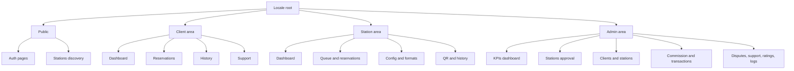
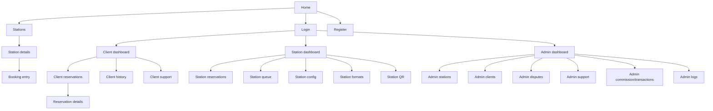

# LAVO Page Listing

This project has a frontend web UI. All routes are **locale-prefixed** using `next-intl`:

- `/fr/...` (default)
- `/en/...`

Below, routes are shown as `/[locale]/...`.

## Route Structure Overview

## Page Inventory

| Route | Page Name | Description | Auth Required | Roles | Key Components |
|---|---|---|---|---|---|
| `/[locale]` | Home | Welcome entry point and system check | No | All | `MainLayout` |
| `/[locale]/login` | Login | Sign in to access protected areas | No | All | `LoginForm` |
| `/[locale]/register` | Register | Client account creation | No | All | `RegisterForm` |
| `/[locale]/register/confirmation` | Register confirmation | Post-registration confirmation screen | No | All | `MainLayout` |
| `/[locale]/forgot-password` | Forgot password | Request password reset email | No | All | `MainLayout` |
| `/[locale]/reset-password` | Reset password | Set a new password via token | No | All | `MainLayout` |
| `/[locale]/verify-email` | Verify email | Email verification via token | No | All | `MainLayout` |
| `/[locale]/stations` | Stations | List and search stations | No | All | `SearchBar`, `StationCard` |
| `/[locale]/stations/[id]` | Station details | Details, availability, formats, booking entry | No | All | `StationDetail` |
| `/[locale]/client/dashboard` | Client dashboard | Client overview and shortcuts | Yes | CLIENT | `ClientLayout` |
| `/[locale]/client/reservations` | Client reservations | List of reservations and statuses | Yes | CLIENT | `ReservationCard` |
| `/[locale]/client/reservations/new` | New reservation | Start a booking flow | Yes | CLIENT | `SlotPicker` |
| `/[locale]/client/reservations/[id]` | Reservation details | Reservation detail view | Yes | CLIENT | `ReservationCard` |
| `/[locale]/client/reservations/[id]/confirm` | Confirm presence | Presence confirmation flow | Yes | CLIENT | `ClientLayout` |
| `/[locale]/client/history` | Client history | Reservations and transaction history | Yes | CLIENT | `ClientHistoryTable` |
| `/[locale]/client/support` | Client support | Create/view support tickets | Yes | CLIENT | `ClientLayout` |
| `/[locale]/station/dashboard` | Station dashboard | Station overview and KPIs | Yes | STATION | `StationLayout` |
| `/[locale]/station/queue` | Station queue | Queue management and late handling | Yes | STATION | `StationLayout` |
| `/[locale]/station/reservations` | Station reservations | Today’s reservations and validation actions | Yes | STATION | `StationLayout` |
| `/[locale]/station/config` | Station config | Opening hours, posts, durations, tolerances | Yes | STATION | `StationLayout` |
| `/[locale]/station/formats` | Vehicle formats | Manage vehicle formats and pricing | Yes | STATION | `StationLayout` |
| `/[locale]/station/history` | Station history | Transactions, payouts, refunds, tips history | Yes | STATION | `StationLayout` |
| `/[locale]/station/qr` | Station QR | QR generation and sharing | Yes | STATION | `StationLayout` |
| `/[locale]/station/support` | Station support | Create/view support tickets | Yes | STATION | `StationLayout` |
| `/[locale]/admin` | Admin home | Admin entry page | Yes | SUPER_ADMIN | `AdminLayout` |
| `/[locale]/admin/dashboard` | Admin dashboard | Global KPIs and anomalies | Yes | SUPER_ADMIN | `DashboardKpiCards` |
| `/[locale]/admin/stations` | Stations management | Manage stations list and details | Yes | SUPER_ADMIN | `AdminLayout` |
| `/[locale]/admin/stations/pending` | Pending stations | KYC pending approval list | Yes | SUPER_ADMIN | `PendingKycList` |
| `/[locale]/admin/stations/[id]` | Station review | Station detail and KYC decision | Yes | SUPER_ADMIN | `AdminLayout` |
| `/[locale]/admin/clients` | Clients management | Manage platform clients | Yes | SUPER_ADMIN | `AdminLayout` |
| `/[locale]/admin/clients/[id]` | Client details | Client profile and activity | Yes | SUPER_ADMIN | `AdminLayout` |
| `/[locale]/admin/disputes` | Disputes | List and triage disputes | Yes | SUPER_ADMIN | `AdminLayout` |
| `/[locale]/admin/disputes/[id]` | Dispute details | Dispute timeline and refund action | Yes | SUPER_ADMIN | `AdminLayout` |
| `/[locale]/admin/commission` | Commission settings | Configure platform commission rate | Yes | SUPER_ADMIN | `AdminLayout` |
| `/[locale]/admin/transactions` | Transactions | Global Stripe transaction logs | Yes | SUPER_ADMIN | `AdminLayout` |
| `/[locale]/admin/platform-settings` | Platform settings | Global settings and parameters | Yes | SUPER_ADMIN | `AdminLayout` |
| `/[locale]/admin/support` | Support tickets | Admin ticket list and triage | Yes | SUPER_ADMIN | `AdminLayout` |
| `/[locale]/admin/support/[id]` | Ticket details | Ticket thread and resolution actions | Yes | SUPER_ADMIN | `AdminLayout` |
| `/[locale]/admin/ratings` | Ratings moderation | View and moderate ratings | Yes | SUPER_ADMIN | `RatingForm`, `StarRating` |
| `/[locale]/admin/logs` | Admin logs | Audit log of admin actions | Yes | SUPER_ADMIN | `AdminLayout` |

## Protected vs Public Routes

- **Public**: `/[locale]`, `/[locale]/login`, `/[locale]/register`, `/[locale]/forgot-password`, `/[locale]/reset-password`, `/[locale]/verify-email`, `/[locale]/stations`, `/[locale]/stations/[id]`
- **Protected (CLIENT)**: `/[locale]/client/*`
- **Protected (STATION)**: `/[locale]/station/*`
- **Protected (SUPER_ADMIN)**: `/[locale]/admin/*`

## Page Hierarchy

