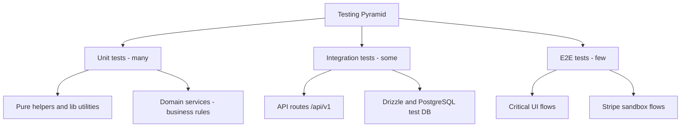
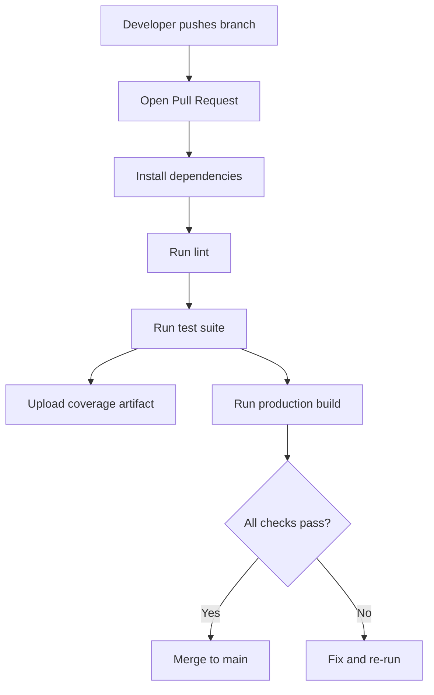

# LAVO Testing Strategy

## Testing Pyramid



## Test Coverage Goals

- **Unit**: 80%+ on helpers, utilities, and domain services
- **Integration**: cover critical endpoints per domain (auth, stations, reservations, payments)
- **E2E**: cover primary booking journey and admin governance checkpoints

## Testing Tools

- **Jest**: test runner
- **React Testing Library**: component and interaction testing
- **jest-dom**: DOM matchers
- **jsdom**: browser-like test environment for UI tests

## Running Tests

```bash
npm test
npm run test:watch
npm run test:coverage
```

Expected output includes a Jest summary and (for coverage) a coverage report generated by V8.

## CI/CD Integration

Tests are intended to run automatically on every pull request and on main branch merges:



