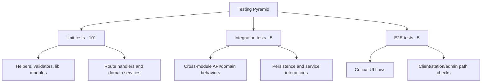
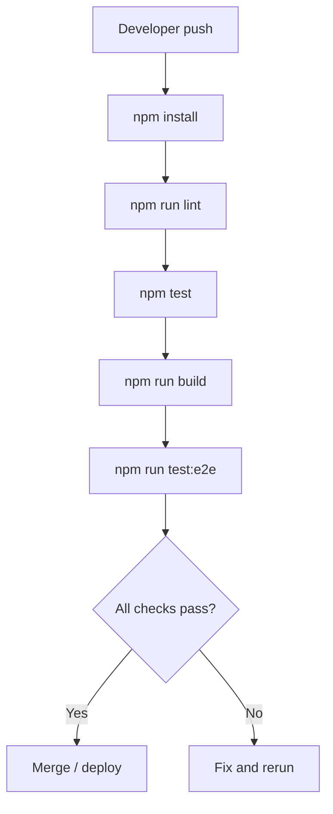

# Hurryline Testing Strategy

## Testing Pyramid



## Test Coverage Goals

- **Unit**: High confidence on business rules and boundary validation.
- **Integration**: Validate critical workflows across modules.
- **E2E**: Protect top user journeys and role-based UX integrity.

## Testing Tools

- **Jest** (`npm test`, `npm run test:watch`, `npm run test:coverage`)
- **React Testing Library** + **jest-dom**
- **Playwright** (`npm run test:e2e`, `npm run test:e2e:ui`)

## Running Tests

```bash
npm test
npm run test:watch
npm run test:coverage
npm run test:e2e
```

Expected results:

- Jest summary with pass/fail count.
- Coverage output for unit-focused scope.
- Playwright report for end-to-end scenarios.

## CI/CD Integration



## Current Test Inventory

- Unit: **101** files
- Integration: **5** files
- E2E: **5** specs

